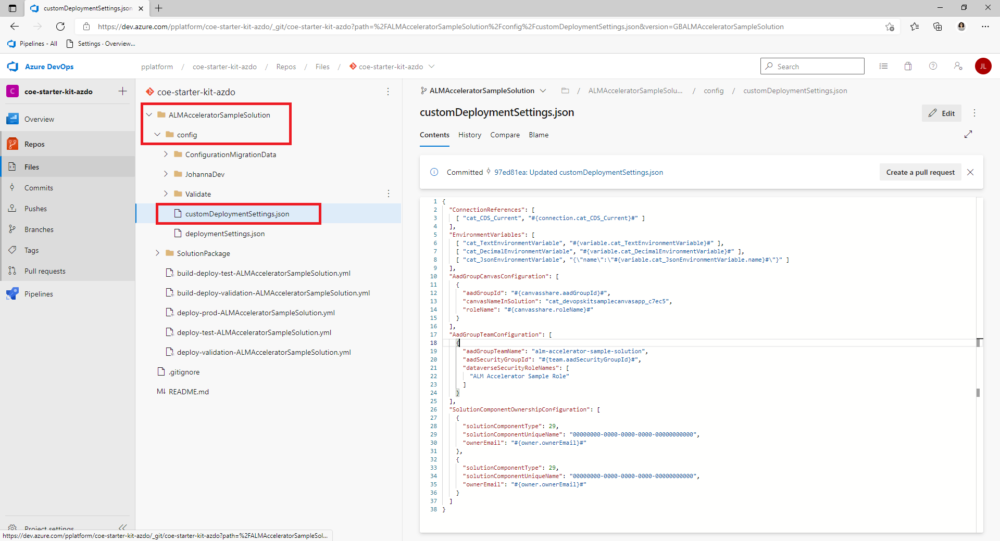
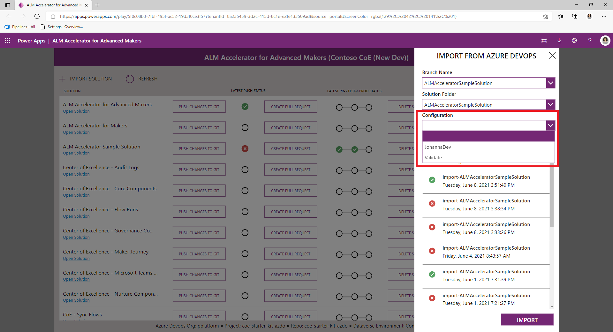
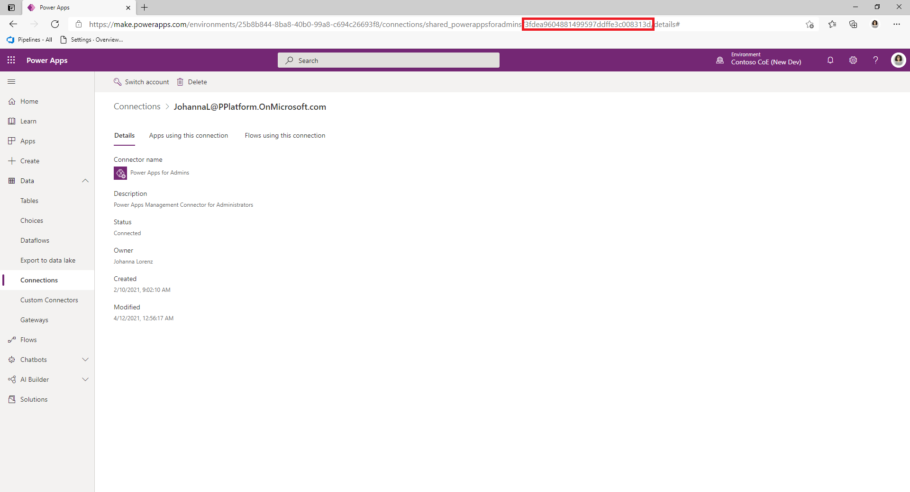
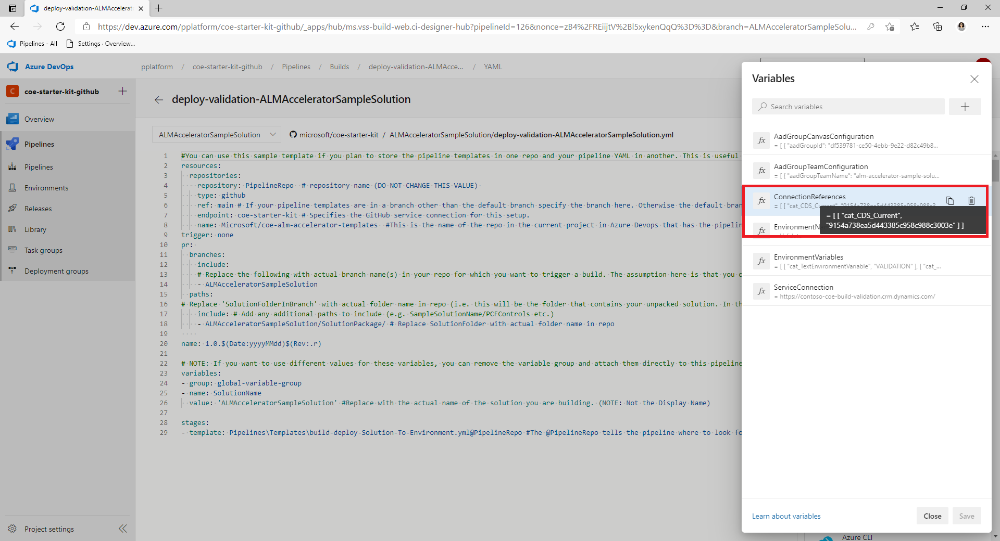
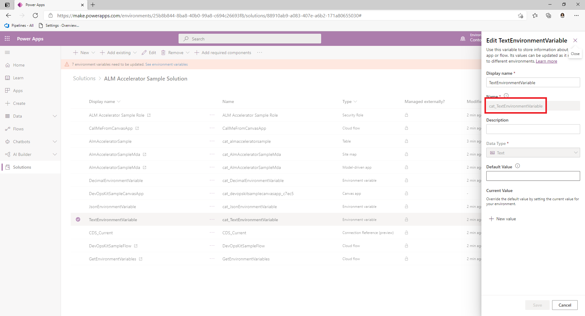
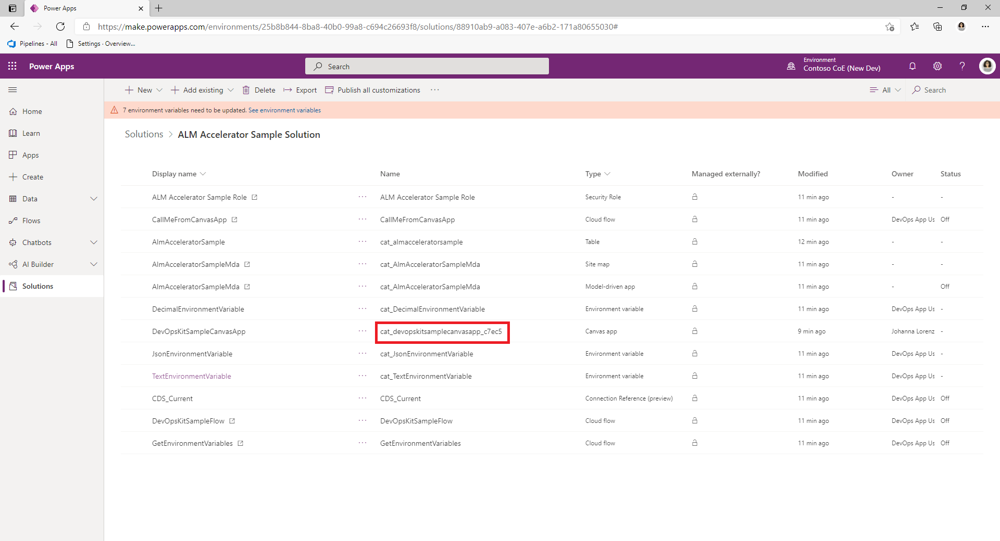
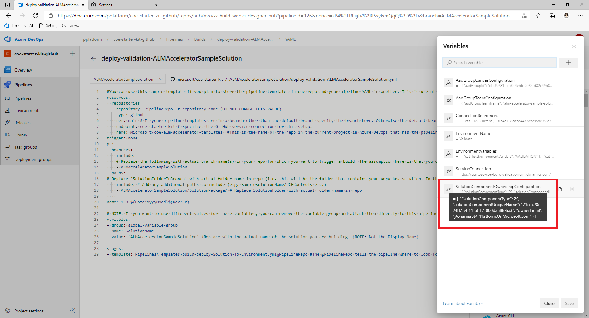

# Configuration and Data Deployment in Pipelines

The ALM Accelerator uses JSON formatted variables for updating **connection references, environment variables, setting permissions for AAD Groups and Dataverse teams** as well as **sharing Canvas Apps and updating ownership of solution components** such as Power Automate flows. The instructions below are **optional** and depend on what type of components your solution pipelines deploy. For instance, if your solutions only contain Dataverse Tables, Columns and Model Driven Apps with no per environment configuration needed then **some of these steps may not be necessary** and can be skipped. The following variables allow you to fully automate the deployment of your solutions and specify how to configure items that are specific to the environment to which the solution is being deployed.

## Creating a Custom Deployment Settings Json File

The deployment settings JSON file contains all of the configuration settings required to automate the deployment of your solution. The following is a sample of a custom deployment settings json file which will provide your pipelines with the necessary information required to configure a solution after it's been deployed to an environment.

```
{
  "ConnectionReferences": [
    [ "cat_CDS_Current", "#{connection.cat_CDS_Current}#" ]
  ],
  "EnvironmentVariables": [
    [ "cat_TextEnvironmentVariable", "#{variable.cat_TextEnvironmentVariable}#" ],
    [ "cat_DecimalEnvironmentVariable", "#{variable.cat_DecimalEnvironmentVariable}#" ],
    [ "cat_JsonEnvironmentVariable", "{\"name\":\"#{variable.cat_JsonEnvironmentVariable.name}#\"}" ]
  ],
  "AadGroupCanvasConfiguration": [
    {
      "aadGroupId": "#{canvasshare.aadGroupId}#",
      "canvasNameInSolution": "cat_devopskitsamplecanvasapp_c7ec5",
      "roleName": "#{canvasshare.roleName}#"
    }
  ],
  "AadGroupTeamConfiguration": [
    {
      "aadGroupTeamName": "alm-accelerator-sample-solution",
      "aadSecurityGroupId": "#{team.aadSecurityGroupId}#",
      "dataverseSecurityRoleNames": [
        "ALM Accelerator Sample Role"
      ]
    }
  ],
  "SolutionComponentOwnershipConfiguration": [
    {
      "solutionComponentType": 29,
      "solutionComponentUniqueName": "00000000-0000-0000-0000-00000000000",
      "ownerEmail": "#{owner.ownerEmail}#"
    },
    {
      "solutionComponentType": 29,
      "solutionComponentUniqueName": "00000000-0000-0000-0000-00000000000",
      "ownerEmail": "#{owner.ownerEmail}#"
    }
  ]
}
```

There are a few things to note about the sample above.

1. The **values delimited by #{}# are tokens** that are used by the third party 'Replace Tokens' extension that you may or may not have chosen to install when following the [Setup Guide](SETUPGUIDE.md#install-azure-devops-extensions). These tokens can be replaced by secure pipeline variables so **secrets are not stored in source control**.

1. There is an alternative to using the Replace Tokens 3rd Party extension which uses **File Transformation task** without the need for any Azure DevOps extensions. You can **read more about using the File Transformation task** here https://docs.microsoft.com/en-us/azure/devops/pipelines/tasks/transforms-variable-substitution?view=azure-devops&tabs=Classic#jsonvarsubs. 

1. If you choose not to install the 'Replace Tokens' extension you will need to modify the deploySolution.yml pipeline template to exclude the call to the extension as the example below shows.

   ```
   # Third party task to replace tokens in files. The FileTransform above replaces JSON tokens based on their path as opposed to replacing text tokens in a file which can be more error prone in some cases.
   # If you aren't using this task it can be safely removed. Sample token: #{VariableNameToReplace}#
   #- task: qetza.replacetokens.replacetokens-task.replacetokens@3
   #  displayName: 'Replace Tokens: deploymentSettings.json'
   #  inputs:
   #    rootDirectory: '$(ArtifactDropPath)'
   #    targetFiles: '*deploymentSettings*.json'
   #    actionOnMissing: 'silently continue'
   #  condition: and(succeeded(), or(ne(variables['DeploymentSettingsPath'], ''), ne(variables['CustomDeploymentSettingsPath'], 3'')))
   ```

   

To create custom deployment settings JSON file follow the steps below

1. Copy the above json to a new file called **customDeploymentSettings.json**

2. Create a **new Directory called config** and save the new file **under the config folder** in git.

   

   > [!IMPORTANT] When storing the customDeploymentSettings.json in the root of the config directory the same configuration will apply to all envionments. Assuming that you are using File Transformation or Token Replacement to store all of the environment specific information, you can specify the environment specific values in your Pipeline Variables. However, you can also create environment specific customDeploymentSettings.json files by creating sub-directories in the config directory with the name of the Envioronment to allow for more flexibility. The directory name in this case **must match the EnvironmentName pipeline variable** you created when setting up your pipeline (e.g. Validate, Test, Production). Additionally, you can create user specific configuration files (e.g. the JohannaDev directory pictured above) for individual developers to use when importing unmanaged solutions from source control. When the user imports an unmanaged solution from source control they will be presented with the option to choose a specific configuration.
   >
   > 

#### Create Connection Reference JSON (Optional)

The connection reference property in the customDeploymentConfiguration.json is **ConnectionReferences**. This is used for setting connection references in your solution to specific connections configured in a target environment after the solution is imported into an environment. Additionally, the **ConnectionReferences** are used to enable flows after the solution is imported based on owner of the connection specified in the variable.

1. **You will need to create the connections manually in your target environments and copy the IDs** for the connection to use in the JSON value below

1. The format of the JSON for these variables take the form of an array of name/value pairs.

   ```json
   [
      [ 
        "connection reference1 schema name",
        "my environment connection ID1"
      ],
      [
        "connection reference2 schema name",
        "my environment connection ID2"
      ]
   ]
```

   - The **schema name** for the connection reference can be obtained from the **connection reference component** in your solution.
     

   - The **connection id** can be obtained via the URL of the connection after you create it. For example the id of the connection below is **9f66d1d455f3474ebf24e4fa2c04cea2** where the URL is https://.../connections/shared_commondataservice/9f66d1d455f3474ebf24e4fa2c04cea2/details#
     

1. Once you've gathered the connection reference schema names and connection ids go to the pipeline for your solution that you created above Select **Edit -> Variables**

1. On the **Pipeline Variables** screen create the **ConnectionReferences** pipeline variables.

1. Set the value to the JSON formatted array of connection reference schema and connection ids.

   - For the example above the values look like the following
     

1. Where applicable repeat the steps above for each solution / pipeline you create.

#### Create Environment Variable Pipeline Variable (Optional)

The environment variable pipeline variable is **EnvironmentVariables**. This pipeline variable is used for setting Dataverse **Environment variables** in your solution after the solution is imported into an environment.

1. The format of the JSON for these variables take the form of an array of name/value pairs.

```
   [
      [
         "environment variable1 schema name",
         "environment variable1 value"
      ],
      [
         "environment variable2 schema name",
         "environment variable2 value"
      ]
   ]

```

   - The **schema name** for the environment variable can be obtained from the **environment variable component** in your solution.
     

1. Once you've gathered the environment variable schema names and connection ids go to the pipeline for your solution that you created above

1. Click Edit -> Variables

1. On the Pipeline Variables screen create the **EnvironmentVariables** pipeline variables.

1. Set the value to the JSON formatted array of environment variable schema and values.

1. For the example above the values look like the following
   

1. Where applicable repeat the steps above for each solution / pipeline you create.

#### Create AAD Group Canvas Configuration Pipeline Variable (Optional)

The AAD group canvas configuration pipeline variable is **AadGroupCanvasConfiguration**. This pipeline variable is used for **sharing canvas apps** in your solution with specific **Azure Active Directory Groups** after the solution is imported into an environment.

1. The format of the JSON for these variables take the form of an array of objects. The **roleName** can be one of **CanView**, **CanViewWithShare** and **CanEdit**

   ```json
   [
    {
        "aadGroupId": "azure active directory group id",
        "canvasNameInSolution": "canvas app schema name1",
        "roleName": "CanView"
    },
    {
        "aadGroupId": "azure active directory group id",
        "canvasNameInSolution": "canvas app schema name2",
        "roleName": "CanViewWithShare"
    },
    {
        "aadGroupId": "azure active directory group id",
        "canvasNameInSolution": "canvas app schema name1",
        "roleName": "CanEdit"
    }
   ]
```

   - The **schema name** for the Canvas App can be obtained from the **Canvas App component** in your solution.
     

   - The **azure active directory group id** can be obtained from the **Group blade in Azure Active Directory** from the Azure Portal.
     

1. Once you've gathered the Canvas App schema names and aad group ids go to the pipeline for your solution that you created above

1. Click Edit -> Variables

1. On the Pipeline Variables screen create the **AadGroupCanvasConfiguration** pipeline variables.

1. Set the value to the JSON formatted array of objects per the sample above.

1. For the example above the values look like the following
   
   Where applicable repeat the steps above for each solution / pipeline you create.

#### Create AAD Group / Team Configuration Pipeline Variable (Optional)

The pipeline variable is **AadGroupTeamConfiguration**. This pipeline variable is used for mapping **Dataverse Teams and Roles** to specific **Azure Active Directory Groups** after the solution is imported into an environment. The security roles will need to added to your solution if they are not manually created in the target environment.

1. The format of the JSON for these variables take the form of an array of objects. One or many roles can be applied to any given team and these roles provide permissions to solution components required by the users in the group.

   ```json
   [
    {
        "aadGroupTeamName": "dataverse team1 name to map",
        "aadSecurityGroupId": "azure active directory group id1",
        "dataverseSecurityRoleNames": [
            "dataverse role1 to apply to the team"
        ]
    },
    {
        "aadGroupTeamName": "dataverse team2 name to map",
        "aadSecurityGroupId": "azure active directory group id2",
        "dataverseSecurityRoleNames": [
            "dataverse role2 to apply to the team"
        ]
    }
   ]
   ```

   - The **Dataverse team name** can be any **existing team or a new team** to be created in Dataverse and mapped to an AAD Group after the solution is imported via the pipeline.

   - The **azure active directory group id** can be obtained from the **Group blade in Azure Active Directory** from the Azure Portal.

   

   - The **Dataverse role** can be any **Security Role in Dataverse** that would be applied to the **existing or newly created Team** after the solution is imported via the pipeline. The role should have permissions to the resources required by the solution (e.g. Tables and Processes)

1. Once you've gathered the team names, aad group ids and roles go to the pipeline for your solution that you created above. Click Edit -> Variables

1. On the Pipeline Variables screen create the **AadGroupTeamConfiguration** pipeline variables.

1. Set the value to the JSON formatted array of environment variable schema and values.

1. For the example above the values look like the following
   

1. Where applicable repeat the steps above for each solution / pipeline you create.

#### Create Solution Component Ownership Pipeline Variable (Optional)

The  pipeline variable is **SolutionComponentOwnershipConfiguration**. This variable is used for assigning ownership of solution components to Dataverse Users after the solution is imported into an environment. This is particularly useful for components such as Flows that will be owned by default by the Service Principal user when the solution is imported by the pipeline and organizations want to reassign them after import. Additionally, the  **SolutionComponentOwnershipConfiguration** will be used to enable flows that don't have any connection references. The flow will be enabled by the user specified when no connection references are found to use to enable the flow.

>[!NOTE] The current pipeline only implements the ability to set ownership of Flows. The ability to assign other components to users could be added in the future.

1. The format of the JSON for these variables take the form of an array of objects.

   ```json
   [
    {
        "solutionComponentType": solution component1 type code,
        "solutionComponentUniqueName": "unique id of the solution component1",
        "ownerEmail": "new owner1 email address"
    },
    {
        "solutionComponentType": solution component2 type code,
        "solutionComponentUniqueName": "unique id of the solution component2",
        "ownerEmail": "new owner2 email address"
    }
   ]
   ```

   - The **solution component type code** is based on the component types specified in the following doc https://docs.microsoft.com/en-us/dynamics365/customer-engagement/web-api/solutioncomponent?view=dynamics-ce-odata-9 (e.g. a Power Automate Flow is component type 29). The component type should be specified as an integer value (i.e. with no quotes)
   - The **unique name of the solution component**, in the case of a Power Automate Flow, has to be taken from the unpacked solution. This is a limitation of flows currently not requiring unique names when they are created. As such the only true unique identifier for a Flow is the internal ID the system uses to identify it in a solution.
     
      
   - The **owner email** can be gathered from the user's record in Dataverse or Office 365.

1. Once you've gathered the component type codes, unique name of the components and owner emails go to the pipeline for your solution that you created above

1. Click Edit -> Variables

1. On the Pipeline Variables screen create the **SolutionComponentOwnershipConfiguration** pipeline variables.

1. Set the value to the JSON formatted array of environment variable schema and values.

1. For the example above the values look like the following
   

1. Where applicable repeat the steps above for each deployment solution / pipeline you create.